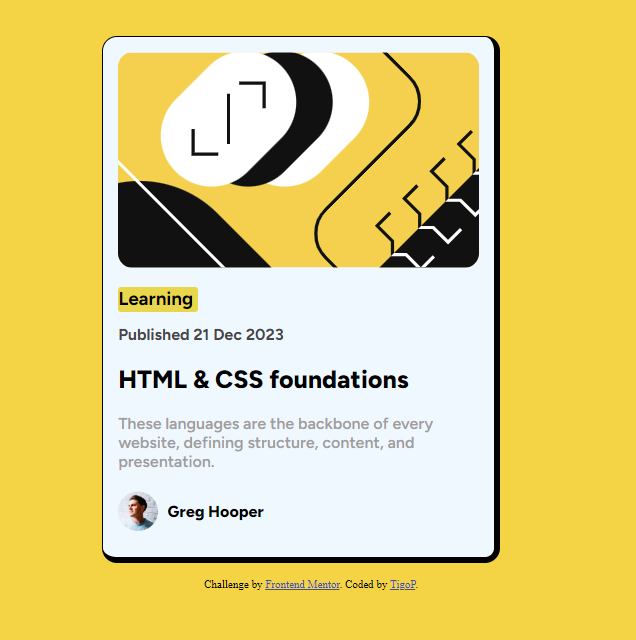
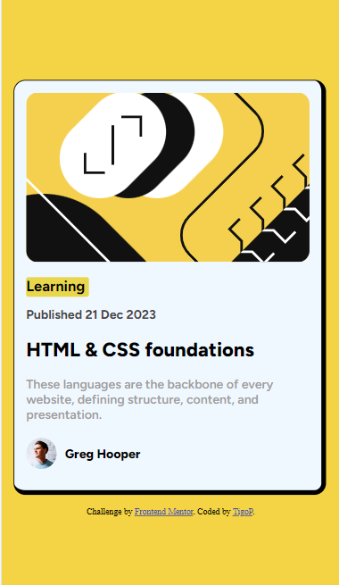

# Frontend Mentor - Profile card component solution

This is a solution to the [Profile card component challenge on Frontend Mentor](https://www.frontendmentor.io/challenges/profile-card-component-cfArpWshJ). Frontend Mentor challenges help you improve your coding skills by building realistic projects. 

## Table of contents

- [Overview](#overview)
  - [The challenge](#the-challenge)
  - [Screenshot](#screenshot)
- [My process](#my-process)
  - [Built with](#built-with)
  - [What I learned](#what-i-learned)
  - [Continued development](#continued-development)
- [Author](#author)

## Overview

### The challenge

- Este é um desafio feito pelo App FrontEndMentor para ajudar novos e antigos desenvolvedores a progredirem em suas habilidades de programação, raciocinio e visual. Capacitando-os a trabalhar diretamente com o estilo exigido pelo mercado de trabalho.

### Screenshot

DESKTOP

MOBILE

## My process

### Built with

- Semantic HTML5 markup
- CSS custom properties
- Flexbox
- CSS Grid
- Mobile-first workflow

### What I learned

Aprendi a utilizar Display Grid um pouco mais. Aprendi a controlar um pouco mais os elementos pais e filhos do CSS como o casamento de padding, heigth e margins de forma mais adequada. Estou aprendendo a utilizar o flex-box para ajustar os elementos. Aprendi a olhar a imagens e distinguir os elementos de sua criação.

### Continued development

Continuarei a desenvolver em futuros projetos os dados aprendidos acima. Para fixa-los em minha mente e torna-los naturais.

## Author

- LinkedLin - tiago-pereira-n
- Frontend Mentor - [@tigoP](https://www.frontendmentor.io/profile/tigoP)